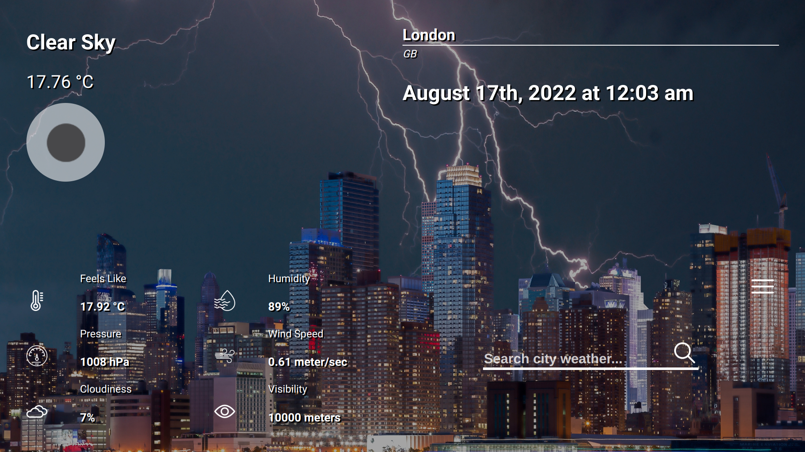
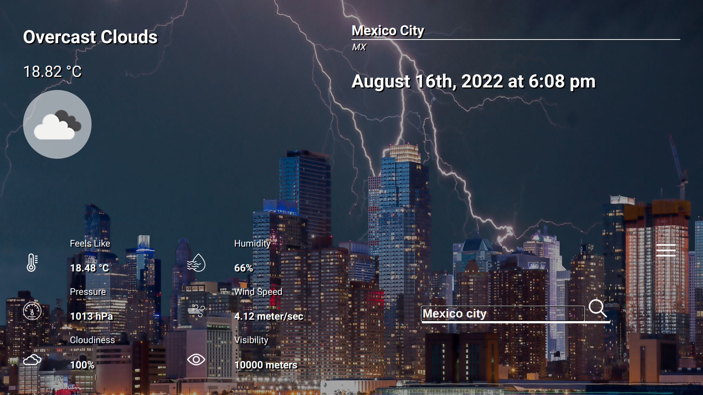
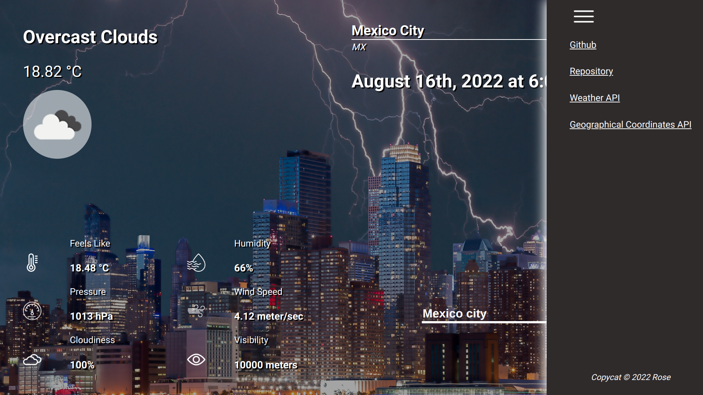

# CityWeather

This project uses **asynchronous code** to get data from **APIs**, specifically the [Current Weather API](https://openweathermap.org/current) and the [Direct Geocoding API](https://openweathermap.org/api/geocoding-api#direct). This project also uses the [human-date](https://www.npmjs.com/package/human-date) package from NPM and it also implements a hamburger menu!

[Link to live demo.](https://rosendo-martinez.github.io/weather-app/) 👈

Website Features:
- Get the current weather data of any city in the world
- Hamburger menu that opens and closes

# Screenshots 

